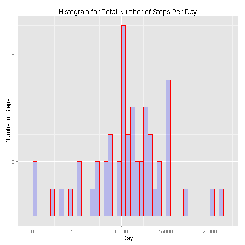
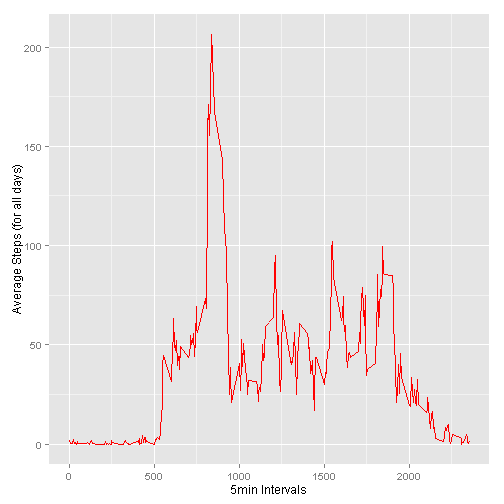
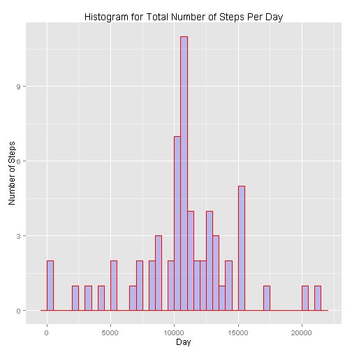
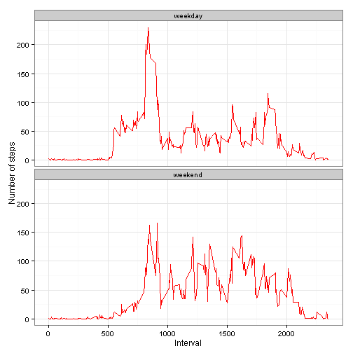

  
***  

####*Author: Demetris Papadopoulos*
<br>  

####*Date: Wednesday, October 14, 2015*
***
  
  
  
###Section 1 - Loading and preprocessing the data
<br>
  
We start by reading the data through the *csv* file that was provided. 
<br>


```r
data<-read.csv("Reproducible/activity.csv")
```

<br>
We process the data set so that the date column is actually of type date instead of type factor.
<br>
<br>

Before:

```r
class(data$date)
```

```
## [1] "factor"
```


After:

```r
processeddata<-transform(data,date=as.Date(date, format = "%Y-%m-%d"))
class(processeddata$date)
```

```
## [1] "Date"
```
***


###Section 2 - What is mean total number of steps taken per day?
<br>
  
Firstly we calculate the total number of steps taken per day, using the aggregate function. For this part we fully ignore NA values. For example, 2012-10-01 as a day will be completely ignored, given that in regards to steps there are just NA values. We proceed as follows:
<br>


```r
totalStepsPerDay<-aggregate(steps ~ date, data = processeddata, sum)
```
<br>

Using that, we create the histogram (ggplot2).


```r
library(ggplot2)
qplot(totalStepsPerDay$steps,
      binwidth = 500,  
      main = "Histogram for Total Number of Steps Per Day", 
      xlab = "Day",
      ylab= "Number of Steps",
      fill=I("blue"), 
      col=I("red"), 
      alpha=I(.2),)
```



We then calculate the mean and the median as required for the total number of steps per day:


```r
totalStepsPerDayMean <- mean(totalStepsPerDay$steps)
totalStepsPerDayMean
```

```
## [1] 10766.19
```

```r
totalStepsPerDayMedian <- median(totalStepsPerDay$steps)
totalStepsPerDayMedian
```

```
## [1] 10765
```
***  

###Section 3 - What is mean total number of steps taken per day?
<br>
<br>
We first use the aggregate function to calculate the average steps taken for all days for each 5 min interval:


```r
avgsteps<-aggregate(steps~interval, data=processeddata, mean)
```

We then create the time series plot which has the 5 min interval on the x-axis and the average steps (for all days) on the y axis:


```r
qplot(avgsteps$interval,avgsteps$steps,geom="line",color=I("red"),xlab="5min Intervals",ylab="Average Steps (for all days)")
```



Now we need to find the 5-minute interval which on average across all the days in the dataset, contains the maximum number of steps. In order to do that we can either use the plot or extract it via code:


```r
avgsteps$interval[which.max(avgsteps$steps)]
```

```
## [1] 835
```

Thus we can see that the exact 5min interval is 835.

***

###Section 4 - What is the average daily activity pattern?
<br>
<br>
Firstly we count the number of NAs using the sum command:


```r
sum(is.na(processeddata))
```

```
## [1] 2304
```

Continuing, we will fill up the missing values, choosing to do it by using the mean steps for that 5 min interval based on all days. We already have the table which includes those values, having processed it in section 3.
<br>
We will now use it to create a new dataset which is complete, with no missing values, filling the missing ones as stated above:


```r
for (i in 1:nrow(processeddata)){
    if (is.na(processeddata[i,1])) {
          n=i%%288
          if (n==0) n=288
          processeddata[i, 1] <- avgsteps[n,2]
          }
    }
```

We then make the same histogram that we made in section 1 (total number of steps taken each day):


```r
library(ggplot2)
totalStepsPerDayNew<-aggregate(steps ~ date, data = processeddata, sum)
qplot(totalStepsPerDayNew$steps,
      binwidth = 500,  
      main = "Histogram for Total Number of Steps Per Day", 
      xlab = "Day",
      ylab= "Number of Steps",
      fill=I("blue"), 
      col=I("red"), 
      alpha=I(.2),)
```



We then calculate the mean and the median as required for the total number of steps per day (using our revised data):


```r
totalStepsPerDayMean <- mean(totalStepsPerDayNew$steps)
totalStepsPerDayMean
```

```
## [1] 10766.19
```

```r
totalStepsPerDayMedian <- median(totalStepsPerDayNew$steps)
totalStepsPerDayMedian
```

```
## [1] 10766.19
```

Comparing our values with our results when we had ignored the missing values, we can see that the values are really close with negligible difference. In this case imputing the data using the strategy chosen made almost no impact at all which is of course expected due to the strategy used.

***

###Section 5 - Are there differences in activity patterns between weekdays and weekends?

We create a new factor variable in the dataset with two levels - "weekday" and "weekend" indicating whether a given date is a weekday or weekend day.


```r
for (i in 1:nrow(processeddata)){
    if (weekdays(processeddata[i,2])=="Saturday" || weekdays(processeddata[i,2])=="Sunday") n="weekend"
    else n="weekday"
    processeddata[i,4] <- n}
```

Using the above, we will now make a panel plot containing a time series plot of the 5-minute interval (x-axis) and the average number of steps taken, averaged across all weekday days or weekend days (y-axis).


```r
colnames(processeddata)[4] <- "day"
avgstepsnew <- aggregate(steps ~ interval + day, data=processeddata, mean)
ggplot(avgstepsnew, aes(x=interval, y=steps)) + 
    geom_line(color="red") + 
    facet_wrap(~ day, nrow=2, ncol=1) +
    labs(x="Interval", y="Number of steps") +
    theme_bw()
```


